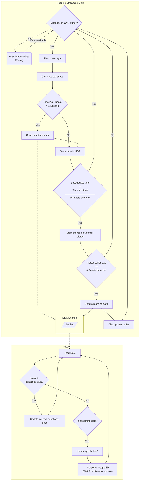

# Plotter Update Process

```mermaid
flowchart TD
    subgraph DataSharing [Data Sharing]
        Socket[/Socket/]
    end


    subgraph ReadStreaming [Reading Streaming Data]
        Message{Message in CAN buffer?} --> |No| Start
        Start("Wait for CAN data \n (Event)") --> |Data available| Message
        Message --> |Yes| Read[Read message]
        Read --> PaketLoss["Calculate paketloss"]
        PaketLoss --> CheckPaketlossTime{"Time last update \n > 1 Second"}
        CheckPaketlossTime --> |No| StoreHDF["Store data in HDF"]
        CheckPaketlossTime --> |Yes| SendPaketlossData["Send paketloss data"]
        SendPaketlossData -.-> DataSharing
        SendPaketlossData --> StoreHDF
        StoreHDF --> TimeCheck

        TimeCheck{"Last update time \n < \nTime slot time \n ———————————— \n # Pakets time slot"}
            --> |Yes| StoreBuffer[Store points in buffer for plotter]
        TimeCheck --> |No| Message
        StoreBuffer --> BufferCheck{"Plotter buffer size \n >= \n # Pakets time slot \n ?"}
        BufferCheck --> |No| Message
        BufferCheck --> |Yes| SendStreamingData["Send streaming data"]
        SendStreamingData -.-> DataSharing
        SendStreamingData --> ClearPlotterBuffer["Clear plotter buffer"]
        ClearPlotterBuffer --> Message
    end

    subgraph Plotter
        DataSharing -.-> ReadData["Read Data"]
        ReadData --> CheckPaketlossData{"Data is \n paketloss data?"}

        CheckPaketlossData --> |Yes| UpdatePaketloss["Update internal paketloss data"]
        UpdatePaketloss --> ReadData

        CheckPaketlossData --> |No| CheckStreamingData{"Is streaming data?"}
        CheckStreamingData --> |Yes| UpdateGraphData["Update graph data"']
        UpdateGraphData --> UpdateGraph["Pause for Matplotlib \n (Wait fixed time for update)"]
        UpdateGraph --> ReadData
    end
```
